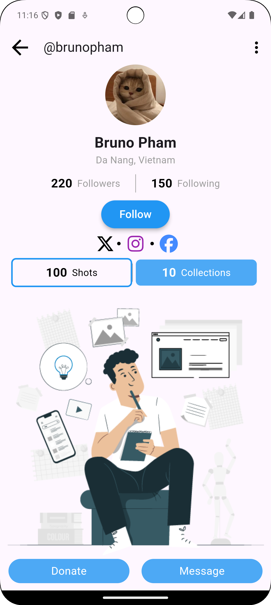
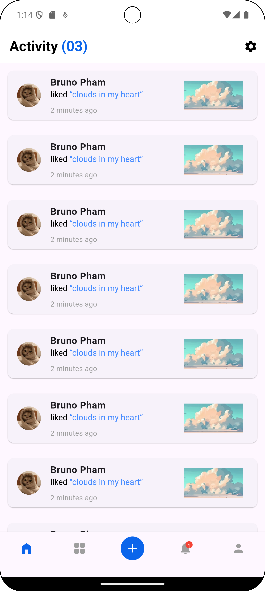

# Profile UI in Flutter

This project is a dynamic profile page UI built using Flutter. It features a user profile section, notification page, and theme switching capabilities, offering a complete UI experience.

## Features

- **Profile Picture**: Circular avatar for the user's profile picture.
- **User Details**: Displays the user's name and location.
- **Stats**: Shows the number of followers and following.
- **Social Media Icons**: Icons for external links (e.g., website, Instagram, Facebook).
- **Action Buttons**: Includes "Donate" and "Message" buttons.
- **Notification Page**: A page that lists user notifications with a customized AppBar, including theme switching between light and dark modes.
- **Bottom Navigation Bar**: Customizable navigation bar with icons, including a notification badge.
- **Theme Switching**: Toggle between light and dark themes using a `ValueNotifier`.

## Getting Started

### Prerequisites

- [Flutter](https://flutter.dev/docs/get-started/install) should be installed on your machine.
- An IDE such as [VS Code](https://code.visualstudio.com/) or [Android Studio](https://developer.android.com/studio).

### Installation

1. Clone the repository:
   ```bash
   git clone https://github.com/your-username/profile_ui.git
   ```
2. Navigate to the project directory:
   ```bash
   cd profile_ui
   ```
3. Get the dependencies:
   ```bash
   flutter pub get
   ```

### Running the App

1. Connect your device or start an emulator.
2. Run the app:
   ```bash
   flutter run
   ```
## Screenshots





## Customization

- **Themes**: Customize the light and dark themes in `light_theme.dart` and `dark_theme.dart`.
- **Notification List**: Modify the content of the notifications in `notification_page.dart`.
- **Profile Page**: Update user details and actions in `profile_page.dart`.


